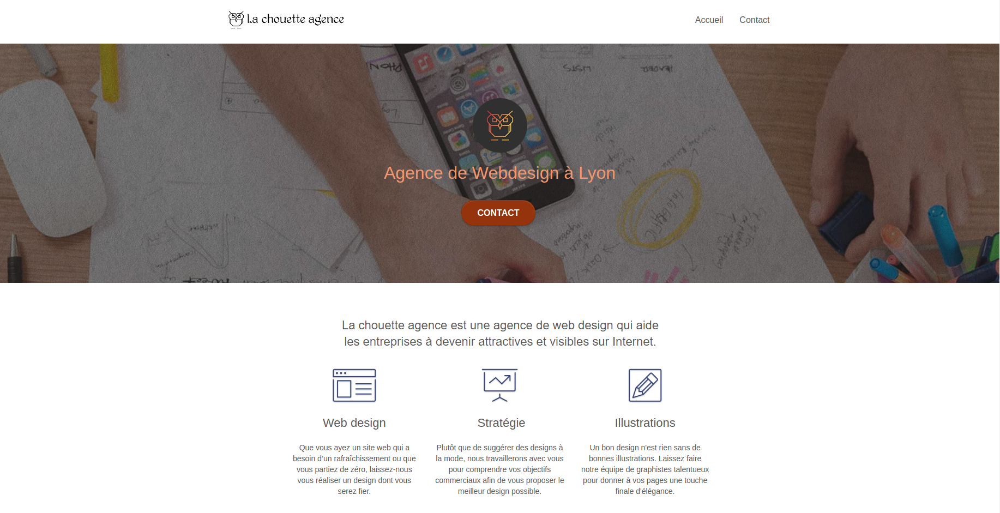

<!-- Please update value in the {}  -->

<h1 align="center">La Chouette Agence</h1>

  OpenClassrooms Project for The <a href="https://openclassrooms.com/en/paths/141-web-developer#path-tabs" target="_blank">Web Developer Training Programm</a>.

  <h3>
    <a href="https://la-chouette-agence-lek.web.app/" target="_blank">
      Solution
    </a>
  </h3>

<!-- TABLE OF CONTENTS -->

## Table of Contents

- [Overview](#overview)
- [Features](#features)
- [Contact](#contact)

<!-- OVERVIEW -->

## Overview

Click on "Solution" to see the page.

## Features

<!-- List the features of your application or follow the template. Don't share the figma file here :) -->

This website is optimized for natural referencing as asked in the 4th project of the Training Programm. The challenge was to add or modify the code in order to fulfill SEO modern rules.

## Contact

- GitHub [@LKurdi292](https://{github.com/lkurdi292})
- Mail [kurdilora@gmail.com]
